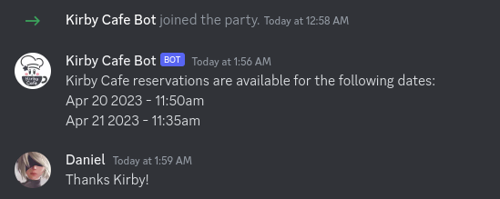

# Kirby Cafe Reservation Checker

A quick app to check if the there are any reservations available at the Kirby Cafe in Tokyo. It runs every couple of minutes and sends me an Discord message if it's in stock.



## Getting Started

Install the dependencies:

```bash
yarn install
```

Copy the .env.example file to .env and fill in the values:

```bash
cp .env.example .env
```

Then run the development server:

```bash
yarn dev
```

Open [http://localhost:3000/api/check](http://localhost:3000/api/check) with your browser to see the result.
